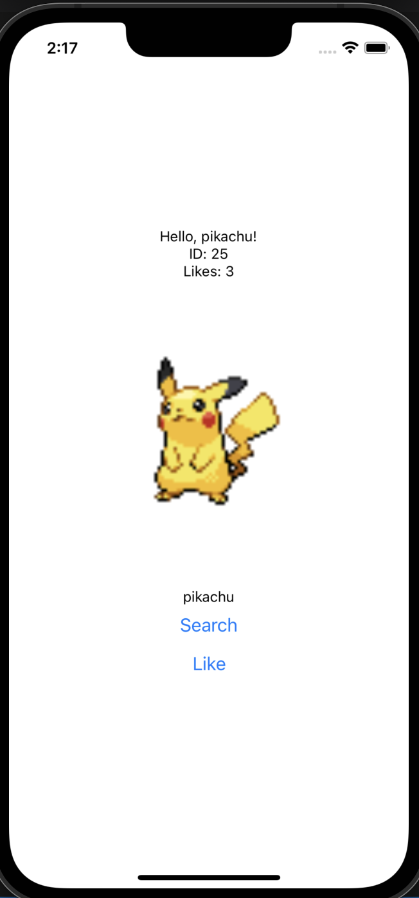

###### CS4261 Programming 1 Assignment

Pokedex app that displays pokemon input built using React Native and deployed to IOS
Gets data from https://pokeapi.co/

### Developer info:

First follow https://reactnative.dev/docs/environment-setup using "React Native CLI Quickstart" to get dev environment

To run use:
"npx react-native start"
and
"npx react-native ios"
in separate terminals

### How to contribute:

1. go to src/Components/Entry.js
2. edit any code in that file and re-run